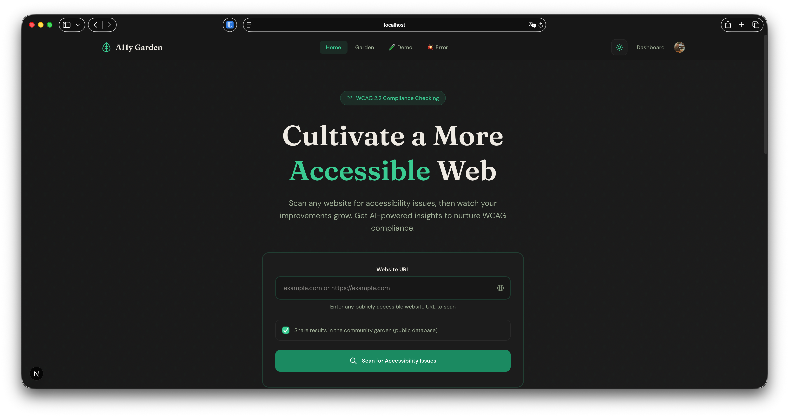
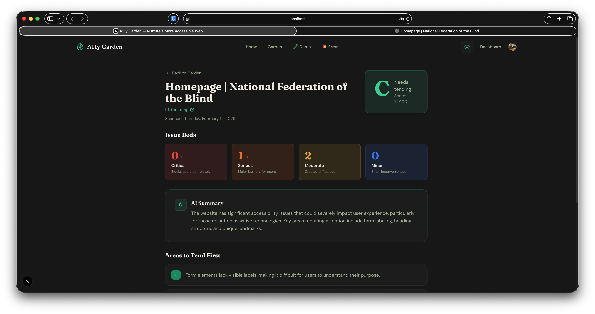
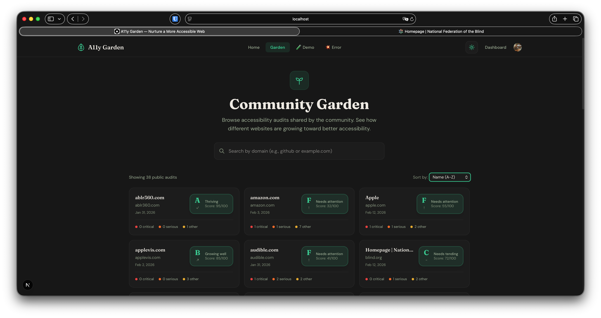

# A11y Garden

> Understand your site's accessibility — and how to improve it.

[](https://www.w3.org/WAI/standards-guidelines/wcag/)
[](https://nextjs.org/)
[](https://convex.dev/)
[](https://www.typescriptlang.org/)
[](LICENSE)

---

## Purpose

A friendly accessibility audit tool that provides AI insights and specific, actionable advice.

---

## Features

- 🔍 **Automated Accessibility Scanning** — Uses axe-core to test websites against WCAG 2.2 guidelines
- 🤖 **AI-Powered Insights** — GPT-4o-mini translates technical violations into plain English explanations
- 📊 **Letter Grade System** — Easy-to-understand A-F grading based on violation severity
- 🗄️ **Community Database** — Browse and search accessibility audits shared by other users
- 👤 **User Accounts** — Save and manage your audit history with Clerk authentication
- ⚡ **Real-time Updates** — Live status updates as scans progress
- 🌗 **Light/Dark Themes** — Modern, accessible interface built with Tailwind CSS v4
- 📋 **Export Reports** — Copy markdown reports for documentation or issue tracking
- 🛡️ **Rate Limiting & Concurrency** — Per-IP sliding window (5 scans/hour) and global concurrency cap via Upstash Redis
- 🔒 **SSRF Protection** — URL validation blocks private IP ranges and non-HTTP schemes in production
- 📸 **Page Screenshots** — Captures a JPEG screenshot at scan time so users can verify the scanner reached the real site (not a firewall page)
- 🧱 **WAF / Bot-Block Detection** — Detects when a site's firewall blocks the scanner and warns the user instead of returning misleading results
- 🔄 **Safe Mode Fallback** — Automatically retries with a reduced rule set when complex sites crash the full axe-core scan
- 🚨 **Error Boundary** — Global React error boundary catches rendering crashes with a friendly recovery UI
- ⚙️ **Graceful Degradation** — Runs without env vars for local demos; a banner warns which features are disabled
- 💻 **CLI Tool** — Scan sites from your terminal with `a11ygarden <url>` and pipe markdown reports to files

---

## Screenshots

<p align="center">
  
</p>

<p align="center">
  
</p>

<p align="center">
  
</p>

---

## Tech Stack

| Layer | Technology |
|-------|------------|
| **Framework** | [Next.js 16](https://nextjs.org/) (App Router) |
| **Language** | [TypeScript 5](https://www.typescriptlang.org/) |
| **Styling** | [Tailwind CSS v4](https://tailwindcss.com/) |
| **Backend** | [Convex](https://convex.dev/) (serverless functions & real-time database) |
| **Authentication** | [Clerk](https://clerk.com/) |
| **Scanning Engine** | [Playwright](https://playwright.dev/) + [axe-core](https://github.com/dequelabs/axe-core) |
| **AI Analysis** | [OpenAI GPT-4o-mini](https://openai.com/) |
| **Rate Limiting** | [Upstash Redis](https://upstash.com/) (sliding window + concurrency) |
| **Fonts** | Fraunces, DM Sans, JetBrains Mono |

---

## Quick Start

```bash
git clone https://github.com/sethwilsonUS/a11y-garden.git
cd a11y-garden
npm install
npx playwright install chromium
npm run local
```

Open **http://localhost:3000** and start scanning. That's it — no accounts, no API keys, no external services.

### Optional: Add AI Summaries

Add an [OpenAI key](https://platform.openai.com/api-keys) to unlock AI-powered analysis:

```bash
echo "OPENAI_API_KEY=sk-..." >> .env.local
# Then restart: npm run local
```

This is the same key the [CLI](#cli-usage) uses. When it's missing, AI features are silently skipped.

### Want the Full Web Experience?

For saved audits, user accounts, the community database, and AI via Convex — see [Full Development Setup](#full-development-setup) below.

---

## CLI Usage

Scan websites from your terminal — no Convex, Clerk, or browser required. Just Playwright + axe-core (and optionally OpenAI for AI summaries).

### Quick Start

```bash
# From the project root (after npm install + npx playwright install chromium)
npm run cli -- example.com
```

### Examples

```bash
# Basic scan (pretty terminal output)
npm run cli -- walmart.com

# Export a markdown report to a file
npm run cli -- walmart.com --markdown > walmart-a11y.md

# Output raw JSON (useful for piping to jq)
npm run cli -- walmart.com --json

# Skip AI summary even when OPENAI_API_KEY is set
npm run cli -- walmart.com --no-ai

# Save a screenshot of the scanned page
npm run cli -- walmart.com --screenshot

# Save screenshot to a custom path
npm run cli -- walmart.com --screenshot walmart-screenshot.jpg

# Scan your local dev server
npm run cli -- localhost:3000

# Force local Playwright even when BROWSERLESS_URL is set
npm run cli -- walmart.com --local
```

### Using as a Command

You can also link the package to use `a11ygarden` as a global command:

```bash
npm link
a11ygarden walmart.com
a11ygarden walmart.com --markdown > report.md
```

### Options

| Flag | Description |
|------|-------------|
| `--markdown` | Output a markdown report instead of the default terminal format |
| `--json` | Output raw JSON |
| `--no-ai` | Skip AI summary even when `OPENAI_API_KEY` is set |
| `--screenshot [path]` | Save a JPEG screenshot of the scanned page (default: `screenshot.jpg`) |
| `--local` | Force local Playwright even when `BROWSERLESS_URL` is set |
| `-V, --version` | Show version number |
| `-h, --help` | Show help |

### Environment Variables (CLI)

| Variable | Required? | Purpose |
|----------|-----------|---------|
| `OPENAI_API_KEY` | No — AI silently skips when missing | Powers AI summaries and recommendations |
| `BROWSERLESS_URL` | No — falls back to local Playwright | Use a remote browser (e.g. Docker Browserless) for parity with the web UI |
| `BROWSERLESS_TOKEN` | No — only needed if your Browserless instance requires auth | Appended to the WebSocket URL as `?token=` |

The CLI automatically loads `.env.local`, so if `BROWSERLESS_URL` is set (e.g. from `dev:browserless`), the CLI uses the same Docker browser as the web UI. Use `--local` to force local Playwright. AI analysis runs automatically when `OPENAI_API_KEY` is in your environment and degrades silently when it isn't.

---

## Scanning Your Local Dev Server

A11y Garden is designed to scan sites you're actively building. Here's how to test your own `localhost` during development.

### Option A: CLI (Simplest)

The CLI runs a local Playwright browser that can reach your dev server directly — no Docker needed.

```bash
# Start your project's dev server (e.g. on port 3000)
# Then, from the a11y-garden directory:
npm run cli -- localhost:3000

# With a screenshot for visual verification
npm run cli -- localhost:3000 --screenshot

# Export a markdown report
npm run cli -- localhost:3000 --markdown > my-app-a11y.md
```

The CLI automatically uses `http://` for localhost URLs (no TLS).

### Option B: Web UI + Browserless (Full Experience)

To scan localhost from the web UI, you need the Browserless Docker container. Without it, the Next.js dev server deadlocks when asked to scan its own origin.

```bash
# Start Docker Browserless + the full dev stack in one command
npm run dev:browserless
```

This starts a Browserless Chromium container and sets `BROWSERLESS_URL` automatically. The scanner rewrites `localhost` URLs to `host.docker.internal` so the Docker container can reach your host machine.

> **Note:** Requires [Docker Desktop](https://www.docker.com/products/docker-desktop/). On Linux, the `--add-host=host.docker.internal:host-gateway` flag is included automatically in the npm script.

### Parity Between CLI and Web UI

When `BROWSERLESS_URL` is set in `.env.local` (which `dev:browserless` does), the CLI uses the same Docker browser as the web UI. This ensures identical scan results between both flows. Use `--local` to force the CLI to use its own local Playwright instead:

```bash
# Uses Browserless (same as web UI)
npm run cli -- walmart.com

# Forces local Playwright
npm run cli -- walmart.com --local
```

---

## Full Development Setup

Working on the full web app with saved audits, user accounts, community database, and AI? You'll need accounts for [Convex](https://convex.dev), [Clerk](https://clerk.com), and [OpenAI](https://openai.com).

### Prerequisites

- Node.js 18+
- Accounts for: [Convex](https://convex.dev), [Clerk](https://clerk.com), [OpenAI](https://openai.com)

### Installation

1. **Clone and install**
   ```bash
   git clone https://github.com/sethwilsonUS/a11y-garden.git
   cd a11y-garden
   npm install
   ```

2. **Set up environment variables**
   ```bash
   cp env.example .env.local
   ```
   
   Fill in your API keys (see [Environment Variables](#environment-variables) below).

3. **Initialize Convex**
   ```bash
   npx convex dev
   ```
   
   This creates your Convex project and deploys the schema. Keep this running.

4. **Add OpenAI key to Convex**
   
   In the [Convex dashboard](https://dashboard.convex.dev), go to **Settings → Environment Variables** and add:
   - `OPENAI_API_KEY` — Your OpenAI API key

5. **Install Playwright browser**
   ```bash
   npx playwright install chromium
   ```

6. **Start development**
   ```bash
   # In a new terminal (keep Convex running)
   npm run dev
   ```

7. Open **http://localhost:3000**

---

## Environment Variables

Copy `env.example` to `.env.local` and fill in the values:

```bash
# Clerk Authentication (https://dashboard.clerk.com)
NEXT_PUBLIC_CLERK_PUBLISHABLE_KEY=pk_test_...
CLERK_SECRET_KEY=sk_test_...
NEXT_PUBLIC_CLERK_SIGN_IN_URL=/sign-in
NEXT_PUBLIC_CLERK_SIGN_UP_URL=/sign-up

# Convex (https://dashboard.convex.dev)
CONVEX_DEPLOYMENT=dev:your-deployment-name
NEXT_PUBLIC_CONVEX_URL=https://your-deployment.convex.cloud

# OpenAI (optional — used by the CLI and local mode for AI summaries)
# The full web app reads OPENAI_API_KEY from the Convex dashboard instead.
# OPENAI_API_KEY=sk-...

# Upstash Redis — rate limiting & concurrency (https://console.upstash.com)
# Optional in dev (rate limiting is disabled without these).
# Required in production to prevent abuse.
# UPSTASH_REDIS_REST_URL=https://...upstash.io
# UPSTASH_REDIS_REST_TOKEN=...

# Force-enable rate limiting in local dev (for testing):
# RATE_LIMIT_ENABLED=true

# OPTIONAL: Browserless
# In production (Vercel), required for scanning (Playwright can't run in serverless).
# In local dev, set automatically by `npm run dev:browserless` for scanning localhost.
# The CLI also picks these up for parity with the web UI (use --local to skip).
# BROWSERLESS_TOKEN=your-token
# BROWSERLESS_URL=ws://localhost:3001  (local Docker) or wss://custom-endpoint (cloud)
```

**Convex dashboard variables** (add these in the [Convex dashboard](https://dashboard.convex.dev) under Settings → Environment Variables, **not** in `.env.local`):

| Variable | Purpose |
|----------|---------|
| `OPENAI_API_KEY` | Powers AI summaries and recommendations |
| `CLERK_JWT_ISSUER_DOMAIN` | Your Clerk Frontend API URL for server-side auth |

### What happens when variables are missing?

The app is designed to degrade gracefully rather than crash:

| Variable | Missing in dev | Missing in production |
|----------|---------------|----------------------|
| `NEXT_PUBLIC_CONVEX_URL` | App runs without Convex/Clerk — `/demo` still works. A banner warns unless running in local mode (`npm run local`). | Same behavior; auth and database features are unavailable. |
| `BROWSERLESS_TOKEN`/`URL` | Not needed — Playwright launches a local browser. Set by `dev:browserless` for localhost scanning from the web UI. | Scan API returns a 500 with a descriptive error message. |
| `OPENAI_API_KEY` (Convex) | AI summary/recommendations are skipped with a clear error logged. | Same — scans work, but AI analysis fails gracefully. |
| `OPENAI_API_KEY` (.env.local) | CLI and local mode skip AI summary when missing. | N/A (CLI / local mode only). |
| `UPSTASH_REDIS_REST_URL/TOKEN` | Rate limiting disabled — all scans allowed. | **Required** — prevents abuse via per-IP rate limits and concurrency caps. |
| `RATE_LIMIT_ENABLED` | Rate limiting stays off (default). Set to `true` to test locally. | Not needed — rate limiting is always on when Upstash vars are present. |

---

## Project Structure

```
├── cli/                       # CLI tool
│   ├── index.ts              # CLI entry point (commander + ora)
│   └── bin.mjs               # Bin wrapper for npm link / npx
├── convex/                    # Convex backend
│   ├── schema.ts             # Database schema
│   ├── audits.ts             # Audit queries & mutations
│   ├── ai.ts                 # OpenAI integration (Convex action)
│   ├── auth.config.ts        # Clerk ↔ Convex auth config
│   └── lib/
│       ├── grading.ts        # Grading algorithm (source of truth)
│       └── grading.test.ts   # Grading tests
├── src/
│   ├── app/                  # Next.js App Router
│   │   ├── page.tsx          # Home page
│   │   ├── providers.tsx     # Convex/Clerk providers (conditional)
│   │   ├── demo/             # Demo mode (no auth required)
│   │   ├── results/          # Audit results pages
│   │   ├── database/         # Community audit database
│   │   ├── dashboard/        # User dashboard (auth required)
│   │   ├── sign-in/          # Clerk sign-in page
│   │   ├── sign-up/          # Clerk sign-up page
│   │   └── api/
│   │       ├── scan/          # Scan API (delegates to shared scanner)
│   │       └── ai-summary/    # AI summary API (local mode + demo)
│   ├── components/
│   │   ├── ErrorBoundary.tsx      # Global React error boundary
│   │   ├── ScanForm.tsx           # URL input + scan orchestration
│   │   ├── ScreenshotSection.tsx  # Collapsible screenshot viewer
│   │   ├── Navbar.tsx             # Top nav (dev links in development)
│   │   ├── GradeBadge.tsx         # Letter grade display
│   │   ├── ViolationCard.tsx      # Severity breakdown cards
│   │   └── ThemeProvider.tsx      # Light/dark theme context
│   └── lib/
│       ├── scanner.ts        # Shared scan engine (Playwright + axe-core)
│       ├── report.ts         # Shared markdown report generator
│       ├── mode.ts           # Local vs. web mode detection
│       ├── ai-summary.ts     # Standalone OpenAI integration (CLI + local mode)
│       ├── grading.ts        # Client-side grading (mirrors Convex)
│       ├── rate-limit.ts     # Upstash rate limiting & concurrency
│       └── url-validator.ts  # SSRF-safe URL validation
└── middleware.ts             # Clerk auth middleware
```

---

## How It Works

### Web App

```
┌──────────┐    ┌──────────┐    ┌──────────┐    ┌──────────┐    ┌──────────┐
│  User    │    │  Rate    │    │  SSRF    │    │Playwright│    │Screenshot│
│  submits │ ─▶ │  Limit   │ ─▶ │  Check   │ ─▶ │+ axe-core│ ─▶ │+ Truncate│
│  URL     │    │ (Upstash)│    │          │    │          │    │ if >500KB│
└──────────┘    └──────────┘    └──────────┘    └──────────┘    └──────────┘
                                                                      │
                                                                      ▼
                ┌──────────┐    ┌──────────┐    ┌──────────┐    ┌──────────┐
                │  Results │ ◀─ │  OpenAI  │ ◀─ │  Convex  │ ◀─ │  Grade   │
                │  Page    │    │ Analysis │    │ Database │    │Calculated│
                │(+screenshot)  │(bkground)|    │(+file    │    │          │
                └──────────┘    └──────────┘    │ storage) │    └──────────┘
                                                └──────────┘
```

### CLI

```
┌──────────┐    ┌──────────┐    ┌──────────┐    ┌──────────┐    ┌──────────┐
│  User    │    │Playwright│    │Screenshot│    │  OpenAI  │    │ Markdown │
│  runs    │ ─▶ │+ axe-core│ ─▶ │+ Grade   │ ─▶ │ Summary  │ ─▶ │ Report   │
│  CLI     │    │(local or │    │Calculated│    │(optional)│    │ → stdout │
└──────────┘    │Browserls)│    └──────────┘    └──────────┘    └──────────┘
                └──────────┘          │
                                      ▼ (if --screenshot)
                                ┌──────────┐
                                │  JPEG    │
                                │  → disk  │
                                └──────────┘
```

1. **User enters a URL** — The scan form validates, normalizes, and strips `www.`
2. **Rate limit checked** — Per-IP sliding window (5/hour) and global concurrency cap (10 simultaneous)
3. **URL validated** — SSRF protection blocks private IPs and non-HTTP schemes in production
4. **Playwright scans** — A headless browser navigates to the page and runs axe-core; falls back to safe mode if the full scan crashes on complex sites
5. **WAF check** — If a firewall blocked the scanner, the user gets a clear message instead of misleading results
6. **Screenshot captured** — A JPEG screenshot is taken of the loaded page (before axe injection) so users can verify the scanner saw the real site
7. **Results truncated** — If raw violations exceed 500 KB, node arrays are trimmed to protect storage
8. **Audit saved** — Only after a successful scan is the audit record created in Convex (avoids orphan records on failure). The screenshot is uploaded to Convex file storage and linked to the audit.
9. **Grade calculated** — A letter grade (A–F) is computed using weighted penalties and hard caps
10. **AI analyzes** — OpenAI generates a plain-English summary and prioritized recommendations (fires in the background)
11. **Results displayed** — The user is redirected to the results page immediately; the AI summary streams in when ready. A collapsible screenshot section lets users verify the scanned page.

---

## Grading System

| Grade | Score | Description |
|-------|-------|-------------|
| **A** | 90–100 | Excellent accessibility |
| **B** | 80–89 | Good accessibility |
| **C** | 70–79 | Fair accessibility |
| **D** | 60–69 | Poor accessibility |
| **F** | 0–59 | Very poor accessibility |

**Penalty weights per violation:**

| Severity | Points Deducted |
|----------|-----------------|
| Critical | −25 |
| Serious | −12 |
| Moderate | −5 |
| Minor | −1 |

**Hard caps** ensure severe issues are always reflected in the grade:

| Condition | Maximum Score |
|-----------|--------------|
| Any critical violations | 55 (grade F) |
| Any serious violations | 72 (grade C) |
| 3+ moderate violations | 85 (grade B) |

The algorithm version is tracked per audit, and grades are lazily recalculated when you view an older report after an algorithm update.

---

## Scripts

```bash
npm run local            # Local mode — just scanning + optional AI (no accounts/database)
npm run dev              # Start Next.js + Convex together (full stack)
npm run dev:next         # Start only Next.js (no local-mode redirects)
npm run dev:convex       # Start only Convex
npm run dev:browserless  # Start with local Docker Browserless (needed for localhost scanning from web UI)
npm run dev:upstash      # Start with rate limiting enabled locally
npm run browserless      # Run the Browserless Docker container
npm run browserless:stop # Stop the Browserless container
npm run build            # Production build (deploys Convex + builds Next.js)
npm run start            # Start production server
npm run cli -- <url>     # Scan a URL from the terminal (see CLI Usage)
npm run test             # Run tests in watch mode (vitest)
npm run test:run         # Run tests once
npm run test:coverage    # Run tests with coverage report
npm run lint             # Run ESLint
```

---

## Production Deployment

### Vercel + Convex

1. Push to GitHub
2. Import project in [Vercel](https://vercel.com)
3. Add environment variables in Vercel dashboard
4. Deploy

For browser-based scanning in production, you'll need [Browserless](https://browserless.io) (free tier available) since Vercel doesn't support running Playwright directly. The app will return a clear 500 error if you forget this variable.

Add to Vercel environment variables:
```
BROWSERLESS_TOKEN=your-token
```

> **Tip:** Large scan results (500 KB+) are automatically truncated to protect Convex storage limits and client performance. Violation counts and grades remain accurate; only duplicate element examples are trimmed.

### Convex Production

```bash
npx convex deploy
```

---

## Contributing

Contributions are welcome! Please see [CONTRIBUTING.md](CONTRIBUTING.md) for guidelines.

---

## License

This project is licensed under the MIT License — see the [LICENSE](LICENSE) file for details.

---

## Acknowledgments

- [axe-core](https://github.com/dequelabs/axe-core) — The accessibility testing engine that powers the scanning
- [Playwright](https://playwright.dev) — Browser automation
- [Convex](https://convex.dev) — Real-time backend platform
- [Clerk](https://clerk.com) — Authentication
- [OpenAI](https://openai.com) — AI analysis
- [Upstash](https://upstash.com/) — Serverless Redis for rate limiting
- [Commander.js](https://github.com/tj/commander.js) — CLI framework
- [chalk](https://github.com/chalk/chalk) + [ora](https://github.com/sindresorhus/ora) — Terminal styling and spinners
- [Deque Systems](https://www.deque.com/) — WCAG expertise and axe-core development
